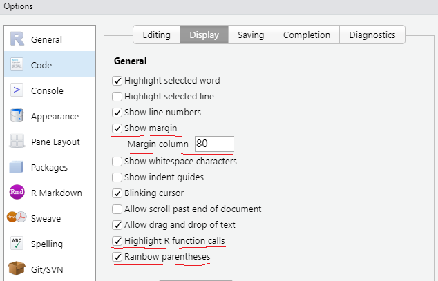
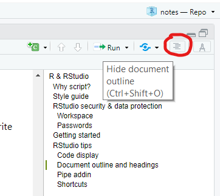
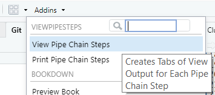

# R & RStudio {#r}

R is the scripting language. RStudio is the IDE (Interactive Development Environment), the tool, that makes it easier to write and debug R scripts. Both need installing on your laptop.

You can choose to use a different IDE with R. VS Code would be the recommended alternative. However, VS Code is very good because of its extensibility, and initially it is not as easy to navigate and configure.

One of the stand-out aspects of R is its user community, who are amazingly helpful and supportive. RStudio plays a key role in the R community.

## Installation

There's some guidance on [Installing R and RStudio](https://rstudio-education.github.io/hopr/starting.html) in the appendix of the [Hands on Programming with R](https://rstudio-education.github.io/hopr/index.html) by Garrett Grolemund.

For Council laptops, you want the 64-bit Windows versions of R and RStudio. It's the free open-source license of RStudio Desktop that we currently use. RStudio is included in the Council's Software Centre, available from your laptop, but it's currently several versions old. R isn't currently available from the Software Centre.

Depending on what permissions you have on your laptop, you may or may not be able to install R and RStudio yourself. If you can't, then you need to make a request via the SCC IT Service Desk. The form to complete is under "Request Something"and is titled "Peripheral & Software Requests". To complete the form you'll need a 20 digit business unit (Integra) code and prior verbal approval from the Business Unit Manager. You may also need to follow this process to update R and RStudio.

RStudio installation is generally straight forward. However, R installation requires write permissions on the R library folder e.g. `C:\Program Files\R\R-4.1.2\library`. Without this, you'll not be able to use R packages other than those provided with the base R installation. You may also need to add a `R_LIBS_USER` *User Environment Variable* and set it to the R library folder e.g. `C:\Program Files\R\R-4.1.2\library`.

## Getting started with R

I'm not going to provide advice on getting started, other than signposting to the excellent resources listed on the RStudio beginners page:

[RStudio Education - Beginners](https://education.rstudio.com/learn/beginner/)

Hadley Wickham's [R for Data Science](https://r4ds.had.co.nz/index.html) is the main book people use when new to R. However, if you already have some coding experience [A Succinct Intro to R](http://r-guide.steveharoz.com/index.html) by Steve Haroz is useful.

A re-styled and searchable version of the R documentation that is easier to use than the original format is provided by RStudio: [rstudio.github.io/r-manuals](https://rstudio.github.io/r-manuals/).

## Library

Other languages, such as Python, use the terms *package* and *library* interchangeably. R is more specific. You extend the base R installation of packages to be more useful, by installing other *packages* into your *library*.

The *library* is just a local folder on your laptop, usually a sub-folder of your R installation e.g. `C:\Program Files\R\R-4.1.2\library`.

`install.packages("dplyr")` **installs** new packages into your *library*. You only need to do this once per package version and laptop (or version of R).

`library(dplyr)` **loads** the previously installed, non base R package, **from** the *library* into your current R session. You need to do this in every R session you're using the non base R package, usually at the top of your script. Alternatively, you can avoid loading the entire package and make use of the `::` notation, for example:\
`droids <- dplyr::filter(dplyr::starwars, species == "Droid")`\
You might do this when writing your own packages or when you want to be explicit in any examples.

## RStudio security & data protection {#pid}

### Workspace {#workspace}

To encourage reproducible R scripts, Hadley Wickham recommends not preserving your workspace between sessions. This entails deselecting a couple of options to save and restore [.Rdata](https://bookdown.org/ndphillips/YaRrr/rdata-files.html) (see [chapter 8 Workflow: projects](https://r4ds.had.co.nz/workflow-projects.html#what-is-real) in Hadley's R4DS book).

Hadley's recommendation also reduces the chances of inadvertently sharing PID in a GitHub repository. However, `.Rdata` should also be included in the [`.gitignore`](https://git-scm.com/docs/gitignore) file and the repository set to private (see the section on [GitHub security & data protection](#github-security)).

### Passwords

It's poor practice to include login details in code. One option is using the `.Renviron` file for [securing credentials](https://db.rstudio.com/best-practices/managing-credentials/#use-environment-variables). However, if you're sharing the script you can anticipate that the environment variable might not be set and use the RStudio API to prompt for credentials. For example:

```{r credentials, eval=FALSE}
portal_pwd <- Sys.getenv("portal_pwd")
if(length(portal_pwd) == 0){
  portal_pwd <- rstudioapi::askForPassword("Portal password")
}
```

## Style guide

Scripting to the same style guide makes collaboration easier. Which style guide is less important than collaborators scripting to the same style guide.

The current recommendation (which is open to discussion) is to follow the [tidyverse style guide](https://style.tidyverse.org/), which benefits from familiarity via tidyverse package documentation, and supporting tools such as the [styler](https://styler.r-lib.org/) RStudio add-in.

## RStudio tips

### Code display

A few non-default Global Options, under Code and Display, make it a little easier to read and write code:

-   Show margin (aim to limit a line of code to 80 characters)

-   Highlight R function calls

-   Rainbow parentheses (since RStudio v1.4)

```{r echo=FALSE}

```

### Document outline & headings

Code sections and subsections are useful:

```{r, eval=FALSE}
# Prefix a section with a hash tag and suffix with 4 or more dashes ----
## Subsections have additional hash tags ----
```

The sections can be collapsed and are also listed in the document outline pane:

```{r echo=FALSE}

```

### ViewPipeSteps addin

The [pipe](https://r4ds.had.co.nz/pipes.html) `%>%` from the `magrittr` package is useful for reading and writing code, but can make debugging cumbersome. The `ViewPipeSteps` addin lets you view the output of your pipe chain after each step. To install:

```{r, eval=FALSE}
devtools::install_github("daranzolin/ViewPipeSteps")
library(ViewPipeSteps)
```

To use:

```{r echo=FALSE}

```

### Base pipe

The `magrittr` pipe has proved so popular that base R now includes its own pipe: `|>`.

There's a setting in *RStudio* \> *Tools* \> *Global Options ...* \> *Code* \> *Editing* to "Use native pipe operator", which includes inserting `|>` instead of `%>%` when you use the keyboard shortcut *Ctrl* + *Shift* + *M*.

### Keyboard shortcuts

RStudio has lots of keyboard shortcuts. What you find most useful is down to preference and the areas of the IDE you use most often. These are a few shortcuts you might find useful:

|                          |                             |
|--------------------------|-----------------------------|
| Ctrl + Enter             | run selected lines          |
| Ctrl + Alt + P           | re-run previous             |
| Ctrl + Shift + C         | comment/uncomment lines     |
| Ctrl + Alt + A           | reformat code               |
| Ctrl + Shift + R         | insert section              |
| Alt + -                  | assignment operator `<-`    |
| Ctrl + Shift + M         | pipe operator `%>%` or `|>` |
| Ctrl + left mouse button | view the object clicked     |
| Ctrl + Shift + F10       | restart R session           |
| Ctrl + Shift + P         | command palette             |

## Further resources

[5 tips for writing clean R code](https://www.r-bloggers.com/2021/03/5-tips-for-writing-clean-r-code-leave-your-code-reviewer-commentless/), by Marcin Dubel in R bloggers (15 March 2021)
