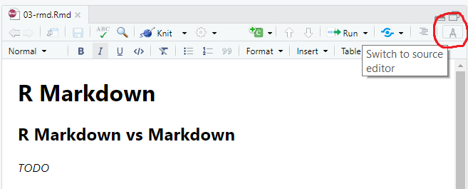

# Markdown {#rmd}

## R Markdown vs Markdown

Markdown is a markup language for creating formatted text using a plain-text editor. Its main aim is readability, for it to have simple, unobtrusive syntax and be readable as-is, unlike text formatted with a markup language such as RTF or HTML. A raw markdown document should be easy to read, as well as the final rendered output.

GitHub has its own flavour of markdown, most commonly used in the `README.md` file that serves to introduce each GitHub repository.

R Markdown is another flavour of markdown. It combines in a reproducible manner: code, output, and commentary. R Markdown documents support different output formats, like PDFs, Word files, slideshows, and HTML. Hadley Wickham [lists](https://r4ds.had.co.nz/r-markdown.html#introduction-18) the three main uses of R Markdown files as:

1.  For communicating to decision makers, who want to focus on the conclusions, not the code behind the analysis.

2.  For collaborating with other data scientists (including future you!), who are interested in both your conclusions, and how you reached them (i.e. the code).

3.  As an environment in which to *do* data science, as a modern day lab notebook where you can capture not only what you did, but also what you were thinking.

R Markdown can be really helpful for keeping data analysis work in a single place, rather than wondering whether notes are in script comments, OneNote or a Word document. Similarly the output is embedded rather than relying on well organised data output folder structures. Finally, the linear nature of a document also provides some structure. Combining R Markdown with GitHub provides version control (an audit trail or log of how the work has evolved), plus GitHub Issues and Actions can add to the project management wrapper around the work.

## R Markdown security & data protection

A limit of R Markdown, or rather our current unapproved use of GitHub, is that a repo for a project with PID or other confidential data must exclude the rendered output of the R Markdown file. The `.Rmd` file is fine to be included in the GitHub repo, but the rendered output e.g. `.pdf` or `.html`, which includes the output of code and probably some of your confidential data, needs to be excluded from the GitHub repo, even if your repo is private. I'm not clear yet what the implications of this are for collaborating with R Markdown e.g. with an R Notebook, but I'd be interested to hear. The limitation does make sharing the R Markdown as rendered output a little cumbersome. The Council's *always on VPN* has made it less so, and the upcoming benefits of the SharePoint upgrade and fuller roll-out of MS Teams functionality will also help. Ultimately though, if GitHub proves useful, we need to make the case for a paid, fuller functioned and more secure Council instance. See the section on [GitHub security & data protection](#github-security) for more detail about this, and in particular how to use `.gitignore` to exclude the rendered R Markdown output from your GitHub repo.

## R Notebooks

*TODO - technical vs data exploration - don't add to github*

## Quarto  

[Quarto](https://quarto.org/) is the medium term replacement for R Markdown that also covers Python and Julia. So if you’re thinking of starting to use R Markdown, probably worth putting your efforts in to Quarto instead.

It's possible to install Quarto without admin rights.  

RStudio includes integration with Quarto, in release v2022.02 onwards.

Tools to make it simple to convert R Markdown to Quarto are expected to be available from summer 2022.

## Bookdown

These notes are written using the [bookdown package](https://pkgs.rstudio.com/bookdown/), which is built on top of R Markdown and [knitr](https://yihui.org/knitr/).

Each Rmd file contains one and only one chapter, and a chapter is defined by the first-level heading `#`.

To understand more about bookdown evolution and Quarto book, visit this [RStudio Community post](https://community.rstudio.com/t/bookdown-evolution-in-response-to-quarto/133163). 

### Themes

The theme of these notes changed in September 2021 from a [GitBook style](https://bookdown.org/yihui/bookdown/html.html#gitbook-style) to a [Three-column Bootstrap style](https://bookdown.org/yihui/bookdown/html.html#bs4-book).

### Publishing {#publishing}

These notes are published on [GitHub Pages](https://pages.github.com/) with [GitHub Actions](https://github.com/features/actions). A GitHub Action has been configured to start when there's a push to the [master branch](https://github.com/scc-pi/notes). The Action renders the Rmd files in the master branch to HTML and then deploys the HTML files as a static website to a branch called `gh-pages`. Alternatives to using GitHub Actions include Travis and Jekyll.

I used the steps outlined in the following blog post: [How to publish bookdown projects with GitHub Actions on GitHub Pages](https://medium.com/@delucmat/how-to-publish-bookdown-projects-with-github-actions-on-github-pages-6e6aecc7331e). However, I did a lot of the git bash commands manually and there were a couple of fixes I made to the `deploy_bookdown.yaml` file:

1\. Under ...

``` {.yaml}
uses: Cecilapp/GitHub-Pages-deploy@master
```

... I added ...

``` {.yaml}
with:       
  build_dir: _book/       
  email: ${{ secrets.EMAIL }}
```

2\. I used `GITHUB_TOKEN` rather than `GH_PAT`, as per a change to [GitHub-Pages-deploy](https://github.com/Cecilapp/GitHub-Pages-deploy#news).

## Flexdashboard

> The goal of flexdashboard is to make it easy to create interactive dashboards for R, using R Markdown.

[pkgs.rstudio.com/flexdashboard](https://pkgs.rstudio.com/flexdashboard/)

Flexdashboards don't have the same functionality of Power BI, nor do they allow data input like Shiny. However, they are very simple and quick to create. They can be a good option if the dashboard is unlikely to be maintained beyond a specific project. The flexdashboard output is simply an HTML file, so it's useful if you need to share the dashboard with a few people outside the organisation. They're also obviously a good option if you've done your data analysis and preparatory work in R. The Council's imminent upgrade of SharePoint and to fuller MS Teams functionality, could be a really useful way to publish flexdashboards.

*TODO: Test whether a fexdashboard can be hosted via our Power BI Report Server in an IFrame.*

[scc-pi.github.io/asc-localities-insight](https://scc-pi.github.io/asc-localities-insight) is an example of flexdashboard. The `.html` file hosted on GitHub has also been added in the "Adult Health and Social Care Programme" MS Team as a [website tab](http://davidgiard.com/2019/01/27/AddingAWebsiteTabToAMicrosoftTeamsChannel.aspx).  

## R Markdown websites  

The starting point for understanding how to build a static website with R Markdown is this RStudio webpage:  

[rmarkdown.rstudio.com/lesson-13.html](https://rmarkdown.rstudio.com/lesson-13.html)

This in turn, points to more detail in The Definitive Guide for R Markdown:  

[bookdown.org/yihui/rmarkdown/rmarkdown-site.html](https://bookdown.org/yihui/rmarkdown/rmarkdown-site.html)

### Build

Have the local copy of the project close to root e.g. *C:/Repo/asc-sna-site*. There were problems building the site with long path names and/or from OneDrive.  

Copy the latest R Markdown files, plus their supporting files and directories, into the local project folder. 

Use the build pane in the RStudio project.

When adding or removing pages you need to do a full build. This ensures that the header and menu options are consistent across all pages. If you're amending a page you only need to knit that one R Markdown file.  

Adding or removing pages needs to be reflected under *navbar* in *_site.yml*.

All R Markdown files in the project folder are knitted during a build unless they are prefixed with an underscore.

### Deploy

The build creates a *_site* folder in the project directory that can be copied whole to a static web server, or failing that a file server. Note that MS Teams and SharePoint aren't intended to serve static websites of this type. 

We're not allowed a static web server, so *_site* is currently copied to:  *S:/BI Team/<project name>*  

As we're using a file server rather than a web server, to view the home page for the site we have to specify the *index.html* in the path that we copy into our browser: *S:/BI Team/<project name>/_site/index.html*  

BI Team members have *full control* permissions for *S:/BI Team* and can add *read* permissions for other Council officers so they can access the site (the files in *S:/BI Team/<project name>*).

After content in the folder is updated, *read* permission has to be re-applied. This doesn't involve re-adding all the names of individual officers, but ensuring *read* is checked and then hitting apply.  

## Rolldown

> [Rolldown](https://github.com/yihui/rolldown/blob/master/README.md) is an R Markdown extension that builds scroll-driven HTML documents for storytelling, a.k.a scrollytelling.

It's similar to the ArcGIS StoryMaps that have proved popular and people might be familiar with.

## Child R Markdown

Here are a couple of use cases for child R Markdown documents:

1.  Your content is so large that breaking it down into smaller parts makes it more manageable.

2.  You want to include the same child R Markdown document in more than one parent document. For example the [libraries repo](https://github.com/scc-pi/libraries) uses a child R Markdown document in a [standalone example](https://github.com/scc-pi/libraries/blob/main/ClusterExample.Rmd) and in a much [larger project documentation document](https://github.com/scc-pi/libraries/blob/main/LibrariesScheduling-BI-Report-14May2021.Rmd).

```{=html}
<script src="https://gist.github.com/laurie-platt/d4323e68c28ee6bf1e6880153416b5d1.js"></script>
```
Note that a child R Markdown has no YAML header, it just inherits its parent's YAML header.

### Iteration

A third and more complicated use case for child R Markdown, is to use a parameter to iterate through a child R Markdown document. You still have a single `parent.Rmd` and a single `child.Rmd` file. However, in the single knitted output file, you have `n` iterations of the child document content depending on the number of values in the parameter. There's a proof-of-concept [example](https://github.com/scc-pi/C19Surveillance/tree/master/r-markdown/UosExample) in the C19Surveillance repo. Three different residential types are passed as a parameter to the child R Markdown document, which renders a map and a summary table for each residential type in the knitted output:

```{=html}
<script src="https://gist.github.com/laurie-platt/79a5e9cd3b08820b781e38cc0996fec2.js"></script>
```

This iteration technique isn't prominent because the demand for such reports outside the Council has largely been superseded by browser based dashboards, such as those provided via Power BI or Shiny. However, the Council hasn't fully transitioned from static reports (e.g. pdf files) to browser based dashboards. Until it has, there may still be an expectation, a demand, for such iterative reports. Plus, the [flexdashboard example](https://scc-pi.github.io/asc-localities-insight) noted above uses child R markdown and iteration, thanks to code largely derived from a [blog by SOMTOM](https://somtom.github.io/post/using-dynamically-rendered-r-markdown-childs-for-reports/) (January 2019).

## R Markdown tips

### Markdown visual editor

The RStudio includes a visual editor for markdown, which makes it more like using MS Word:

```{r echo=FALSE}

```

### Chunk named setup

Naming a code block `setup` means that after you restart RStudio and execute any code in the middle of your markdown document, the `setup` block will run first. For example, to make sure your libraries are loaded first:

```{=html}
<script src="https://gist.github.com/laurie-platt/c8a1e49cabb5f9fa0104ca6daef5dff2.js"></script>
```
## Further resources

[R Markdown from RStudio](https://rmarkdown.rstudio.com/lesson-1.html)  

[Chapter 27 R Markdown](https://r4ds.had.co.nz/r-markdown.html), R4DS by Hadley Wickham.

[Authoring Books and Technical Documents with R Markdown](https://bookdown.org/yihui/bookdown/) by Yihui Xie is the definitive resource for R Markdown.
