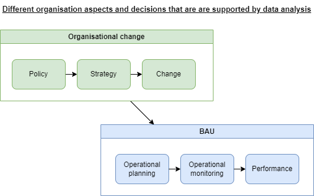

# RAP {#rap}

## Principles

Reproducible Analytical Pipelines (RAPs) have evolved from the UK Govenment's Analysis Function and their 2022 [Reproducible Analytical Pipelines (RAP) strategy](https://analysisfunction.civilservice.gov.uk/policy-store/reproducible-analytical-pipelines-strategy/) sets out the following principles.

"RAPs are automated statistical and analytical processes. They incorporate elements of software engineering best practice to ensure that the pipelines are reproducible, auditable, efficient, and high quality.  

RAPs increase the efficiency of statistical and analytical processes, delivering value. Reproducibility and auditability increase trust in the statistics. The pipelines are easier to quality assure than manual processes, leading to higher quality.

A RAP will:

* improve the quality of the analysis  

* increase trust in the analysis by producers, their managers and users  

* create a more efficient process  

* improve business continuity and knowledge management  

To achieve these benefits, at a minimum a RAP must:

* minimise manual steps, for example copy-paste, point-click, or drag-drop operation; where it is necessary to include a manual step in the process this must be documented as described in the following bullet points  

* be built using open-source software, which is available to anyone, preferably R or Python  

* deepen technical and quality assurance processes with peer review to ensure that the process is reproducible and that the requirements described in the following bullet points have been met  

* guarantee an audit trail using version control software, preferably Git  

* be open to anyone – this can be allowed most easily using file and code sharing platforms  

* follow existing good practice for quality assurance  

* contain well-commented code and have documentation embedded and version controlled within the product, rather than saved elsewhere

Notes:

1. There may be restrictions, such as access to databases, which stop analysis producers building a RAP for their full end-to-end process. In this case, the previously described requirements apply to the selected part of the process.  

1. There may be restrictions, such as sensitive or confidential content, which stop analysis producers from sharing their RAP publicly. In this case, it may be possible to share the RAP within a department or organisation instead.  

1. It is recommended that where possible a RAP should be built collaboratively – this will improve the quality of the final product and helps to allow knowledge sharing.  

There is no specific tool that is required to build a RAP, but both R and Python provide the power and flexibility to carry out end-to-end analytical processes, from data source to final presentation.

Once the minimum RAP has been implemented, statisticians and analysts should attempt to further develop their pipeline using:

* functions or code modularity  

* unit testing of functions  

* error handling for functions  

* documentation of functions  

* packaging  

* code style  

* input data validation  

* logging of data and the analysis  

* continuous integration  

* dependency management"  

## Strategy goals  

The Government's RAP strategy includes three goals:  

1. **tools** – ensure that analysts have the tools they need to implement RAP principles.  

1. **capability** – give analysts the guidance, support and learning to be confident implementing the RAPs.  

1. **culture** – create a culture of robust analysis where the RAP principles are the default for analysis, leaders engage with managing analysis as software, and users of analysis understand why this is important.

## Platforms for Reproducible Analysis

The two lists below are from the Government's RAP strategy, to which we've added *notes on current SCC status*.  

### For RAPs that meet the minimum criteria  

1. version control software, that is, git - *BI Team laptops & OSCAR desktop*  

1. open-source programming languages and flexibility to add more (Python, R, Julia, JavaScript, C++, Java/Scala etc.) - *R & Python on BI Team laptops, R on OSCAR desktop*  

1. package and environment managers for each of the available languages - *should have tested [renv](https://rstudio.github.io/renv/articles/renv.html) for R by now, if extending Council GIS the version of ArcGIS Pro we use has restrictive Conda use e.g. no virtual environments*

1. packages and libraries for open-source programming languages, either through direct access to well-known libraries, for example, npm, PyPI, CRAN, or through a proxy repository system, for example, Artifactory - *BI Team laptops & OSCAR desktop*

1. individual storage, for example, home directory - *SCC OneDrive* 

1. shared storage, for example, s3, cloud storage, with fine-grained access control, accessible programmatically  - *don't have, should we look at Azure Blob storage?*  

1. integrated development environments suitable for the available languages – RStudio for R, Visual Studio Code for Python and so on - *BI Team laptops & OSCAR desktop*  

> *In summary, with the exception of shared storage e.g. Azure Blob storage, some SCC data analysts have access to all of these minimum criteria for RAPs.*  

### For further development of RAPs  

1. source control platforms, for example, GitHub, GitLab or BitBucket - *trialing GitHub organisation ([github.com/scc-pi](github.com/scc-pi))*  

1. continuous integration tools, for example, GitHub Actions, GitLab CI, Travis CI, Jenkins, Concourse - *trialing GitHub Actions but CI limited by the current GitHub security considerations ([GitHub security & data protection](#github-security))*  

1. make-like tools for reproducible workflows, for example, make - *identified the potential value of [targets](https://books.ropensci.org/targets/) r package, but not tested yet*  

1. relational database management software, for example, PostgreSQL, that is available to users - *corporate solution being investigated and there's some DBMS access available via OSCAR desktop*  

1. orchestration systems for pipelines and workflows, for example, airflow, NiFi - *don't have*  

1. internal-facing servers to host html-rendered documentation - *request denied*  

1. external-facing servers with authentication to host end-products such as web applications or APIs - *don't have*    

1. big data tool, for example, Presto or Athena, Spark, dask and so on, or access to large memory capability - *don't have*    

1. reproducible infrastructure and containers, for example, docker - *docker on BI Team laptops but not tested yet* 

> *In summary, SCC data analysts don't have most of the platforms needed for further development of RAPs. Docker and targets are accessible and could be trialed. GitHub is being trialed and purchasing would ease some current security restrictions and could include the CI and server platform items. No consideration yet of orchestration systems or big data tools.*    

## How could RAP sit within SCC data analysis?

*NB This sub-section is currently from the perspective of one individual. It needs a broader perspective, particularly from more experienced colleagues in PAS and data analysis team managers.*

```{r echo=FALSE, out.width="80%"}

```

Sheffield City Council has aspirations to be data-driven, to make better evidence based decisions. Data analysis can support organisational change decisions on, for example, Planning Policy, Corporate Strategy, and changes to the operating model for Early Help in Children's Services. Data analysis can also support continuous improvement under BAU (Business As Usual), helping managers understand how best to deploy their resources over the next month, highlighting issues that arose last week, and reporting performance metrics to senior managers.     

The efficiencies from the automation aspect of RAPs may suit more repetitive (e.g. monthly) data analysis outputs that support BAU. The quality assurance aspect of RAPs may be more important for complex data analysis that supports major organisation change decisions. In practice, team culture and individual capability may have more to do with adopting RAP than the type or purpose of data analysis output. For example, an individual may be more likely to pursue RAP if they have a software development background, and they work in the BI Team that was initially experimental in nature and doesn't have a large catalogue of BAU output and well established quality assurance procedures. 

Elements of RAP have been used by SCC data analysts, but a full RAP has not yet been developed. The Council could pilot one or two RAPs. These should be done collaboratively i.e. with members of different data analysis teams. One could be re-engineering an existing process, another could be a new piece of data analysis.  

## MLOPs

Machine Learning Operations (MLOPs) is more specifically about automating the building, training, deployment, maintenance, and further development of models. RAPs cover a broader range of data analysis output.   

## Further resources {#further-resources-rap}

### Guidance
[Reproducible Analytical Pipelines (RAP)](https://analysisfunction.civilservice.gov.uk/support/reproducible-analytical-pipelines/), Government Analysis Function  
[Reproducible Analytical Pipelines (RAP) strategy](https://analysisfunction.civilservice.gov.uk/policy-store/reproducible-analytical-pipelines-strategy/), Government Analysis Function  
[RAP Community of Practice](https://nhsdigital.github.io/rap-community-of-practice/), NHS Digital  
[Choose tools and infrastructure to make better use of your data](https://www.gov.uk/guidance/choose-tools-and-infrastructure-to-make-better-use-of-your-data), Cabinet Office  

### Training
[Introduction to Reproducible Analytical Pipelines (RAP)](https://learninghub.ons.gov.uk/course/view.php?id=662), free online ONS Data Science Campus Learning Hub course ([hub now available to local government analysts](https://www.local.gov.uk/our-support/research-and-data/ons-data-science-training-now-available-local-government-analysts))  
[Reproducible Analytical Pipelines (RAP) using R](https://www.udemy.com/course/reproducible-analytical-pipelines/), 7hr free online Udemy course by Matthew Gregory  
[Reproducible Analytical Pipeline learning materials](https://github.com/datasciencecampus/gov-uk-rap-materials#reproducible-analytical-pipeline-learning-materials), Data Science Campus  

### Books
[RAP Companion](https://ukgovdatascience.github.io/rap_companion/), by Matthew Gregory & Matthew Upson   
[Building reproducible analytical pipelines with R](https://raps-with-r.dev/), by Bruno Rodrigues   
[The Turing Way: Handbook to Reproducible, Ethical and Collaborative Data Science](https://the-turing-way.netlify.app/index.html), by the Turing Way Community  
[Open Source MLOPs](https://www.amazon.co.uk/Open-Source-MLOPs-Automation-Pipelines-ebook/dp/B0BJ5791TK/ref=sr_1_1?crid=1MU50QRTECXIZ&keywords=Open+Source+MLOPs&qid=1677872361&s=books&sprefix=open+source+mlops%2Cstripbooks%2C172&sr=1-1), by Matthew Upson (release August 2023)   
[Quality assurance of code for analysis and research - the Quack book](https://best-practice-and-impact.github.io/qa-of-code-guidance/checklist_higher.html), ONS  

### Blogs
[Why we’re getting our data teams to RAP](https://digital.nhs.uk/blog/data-points-blog/2023/why-were-getting-our-data-teams-to-rap), 
[Transforming the process of producing official statistics](https://dataingovernment.blog.gov.uk/2017/11/27/transforming-the-process-of-producing-official-statistics/), Civil Service  
[Econometrics and Free Software](https://www.brodrigues.co/), Bruno Rodrigues  
[Data Version Control for Reproducible Analytical Pipelines](https://medium.com/mantisnlp/data-version-control-for-reproducible-analytical-pipelines-5255782d355d), Matthew Upson    

### Slack
[rap_collaboration - Gov Data Science - Slack](https://app.slack.com/client/T06SLTMFD/C6H22U3H9)  

### Examples  
[NHS Sickness Absence Rates](https://github.com/NHSDigital/absence-rates)  

### GitHub templates  
[NHSDigital/rap-package-template](https://github.com/NHSDigital/rap-package-template)  
[govcookiecutter: A template for data science projects](https://dataingovernment.blog.gov.uk/2021/07/20/govcookiecutter-a-template-for-data-science-projects/)  
