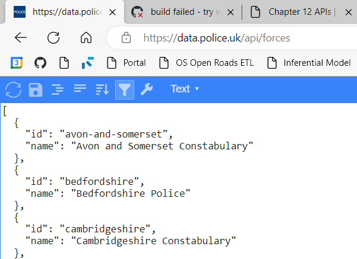

# APIs {#api}

## REST APIs

RESTful

_TODO_
 - Foundation for Council services

## Wrappers {#wrappers}

_TODO_

## Rectangling  

Data returned from REST APIs are typically provided in a hierarchical structure and JSON is the most common format. The tidyverse [Rectangling vignette](https://tidyr.tidyverse.org/articles/rectangle.html) explains how to structure the data from the API into a more familiar tabular structure.

_TODO_   
scc-pi functions with rectangling e.g. postcode and geocoding  

## API via Council proxy  

When in Council buildings and connected directly to the Council's network, rather than via AlwaysOn VPN, you may have difficulty accessing external API's from RStudio (and installing packages and using GitHub). The following post from Posit outlines a method to resolve this: [Configuring R to Use an HTTP or HTTPS Proxy](https://support.posit.co/hc/en-us/articles/200488488-Configuring-R-to-Use-an-HTTP-or-HTTPS-Proxy). 

In summary:  

1. Run the command `file.edit('~/.Renviron')` within RStudio.   

2. Add the following settings to your `.Renviron` file, amended for your own Council login ID and password.  

```{r renviron-proxy, eval=FALSE}
http_proxy=http://172.29.2.22:8080
http_proxy_user=lp41455:password123

https_proxy=https://172.29.2.22:8080
https_proxy_user=lp41455:password123
```

3. Uncheck the setting for *Use Internet Explorer library/proxy for HTTP* in *Global Options*:  

```{r echo=FALSE}
knitr::include_graphics("images/proxy-ie.png")
```

4. Restart RStudio.

When using AlwaysOn VPN comment out the settings:  

```{r renviron-proxy-vpn, eval=FALSE}
# http_proxy=http://172.29.2.22:8080
# http_proxy_user=lp41455:password123
# 
# https_proxy=https://172.29.2.22:8080
# https_proxy_user=lp41455:password123
```

These notes will be updated if we get to figuring out a setting that automatically toggles the proxy setting rather than you having to change this manually.  

To test it's working you could try the following:  

```{r}
#install.packages("httr2")
library(httr2)
req <-  request("https://data.police.uk/api/forces")
resp <- req_perform(req)
resp |> resp_body_html(check_type = FALSE)
```

Which should show you some content similar to what you see when you just use the same URL ([https://data.police.uk/api/forces](https://data.police.uk/api/forces)) in a browser: 

```{r echo=FALSE}

```

These are the breadcrumbs for determining the proxy server and port:  

* Windows settings  

* Proxy settings

* Type the *script address* into Edge i.e. [http://172.29.3.101/proxy.pac](http://172.29.3.101/proxy.pac)  

* Open the downloaded `proxy.pac` file in a text editor

* Try some of the proxy servers and ports listed in `proxy.pac`  

